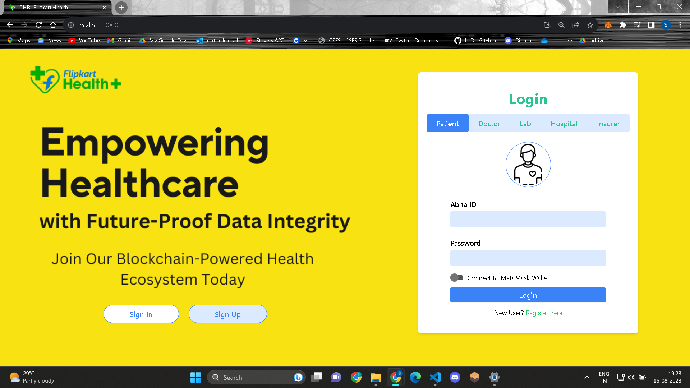

### Blockchain Powered - Electronic Health Record System
- - -
#### 


## Tech Stack Used
- - - 
1. ReactJs - Building frontend.
2. Solidity - Writing Contracts for Ethereum.
3. Remix IDE - For compiling and deploying contracts.
4. MetaMask - For connecting Wallet with website.
5. Pinata CLoud - Decentraised Storage used to store records.

## Steps to Run
- - -
1. Install Metamask extension in your broswer(Preferred is Google Chrome.)

2. Install Ganache on your machine. It will run a local(private) Ethereum Test Network.

3. You can import atleast 5 accounts for each role(Patient, Doctor, Hospital, Laboratory, Insurer) from Ganache to your Metamask wallet by doing as the following.
    
4. Clone this GitHub repository. Open the project in VS Code(preferred) Install all the node modules. Follow the commands on terminal 
    ```
    cd client
    npm install
    ```
6. Setup Pinata, follow [this](https://knowledge.pinata.cloud/en/articles/6191471-how-to-create-an-pinata-api-key) blog. Copy paste **API Key and API SECRET into .env file**.
7. Last step, copy past the three contract files in Remix IDE: **UserManagement, FileManagement & PaymentManagement** and **deploy each one and paste the contract address into .env file**

5. Now you are ready to launch the project. Enter the following on terminal.
    ```
    npm start
    ```

### Insights of UI
1. Landing Page
    
2. Login
    
