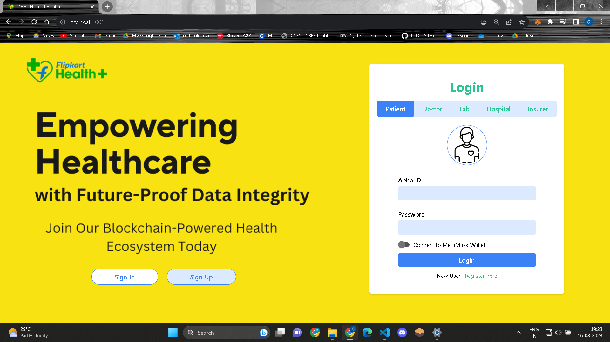

### Blockchain Powered - Electronic Health Record System
- - -
#### 


## Tech Stack Used
- - - 
1. ReactJs - Building frontend.
2. Solidity - Writing Contracts for Ethereum.
3. Remix IDE - For compiling and deploying contracts.
4. MetaMask - For connecting Wallet with website.
5. Pinata CLoud - Decentraised Storage used to store records.

## Steps to Run
- - -
1. Install Metamask extension in your broswer(Preferred is Google Chrome.)

2. Install Ganache to your machine. It will be used to run local(private) our Ethereum Network.

3. You can import atleast 5 accounts for each role(Patient, Doctor, Hospital, Laboratory, Insurer) from Ganache to your Metamask wallet by doing as the following.
    
4. Clone this GitHub repository. Open the project in VS Code(preferred) Install all the node modules. Follow the commands on terminal 
    ```
    cd client
    npm install
    ```
6. Setup Pinata, follow [this](https://knowledge.pinata.cloud/en/articles/6191471-how-to-create-an-pinata-api-key) blog. Copy paste **API Key and API SECRET into .env file**.
7. Last step, copy past the three contract files in Remix IDE: **UserManagement, FileManagement & PaymentManagement** and **deploy each one and paste the contract address into .env file**

5. Now you are ready to launch the project. Enter the following on terminal.
    ```
    npm start
    ```

### Insights of UI
1. Landing Page
    
2. Login
    
3. Register Page
    

<!-- ### Terminal1
- - -
```
cd frontend
npm install
```
### Terminal2
- - -
```
cd middleware
npm install
```

3. Run all the servers - reactjs, nodejs flask.
### Terminal1
- - -
```
cd frontend
npm run start
```
### Terminal2
- - -
```
cd middleware
npm run start
```
### Terminal3
- - -
```
cd backend
python3 main.py
```

## APIs
- - -
1. Admin data API : To populate the dashboard for Admin displaying no of movies per language, Genre, Day wise hits
```
http://localhost:7200/api/admin
```
2.  Coming Soon: API to Display Coming soon movies
```
http://localhost:7200/api/comingSoon
```
3. Recently Viewed: API to display the movies recently viewed by user
```
http://localhost:7200/api/recentlyViewed
```
4. Search : To display list of info on query data
```
http://localhost:7200/api/search?keyword=pirates
```
5. Search on Enter : To display data in cards when enter click on keyword searched
```
 http://localhost:7200/api/search/display?keyword=pirates
```
6. Search Click : To display information(Description,Director,cast etc....) of specific movie clicked by user
```
http://localhost:7200//api/search_click
```
7. News : To display current trending news related to tv, movies, shows etc..
```
http://localhost:7200/api/showNews
```
8. Top 250 : To display top 250 movies , having different filters and sorting options 
```
http://localhost:7200/api/top/250
```
9. User Fav : Displaying movies as per the user fav choice on the basis of clicks and serach
```
http://localhost:7200/api/userFav
``` -->